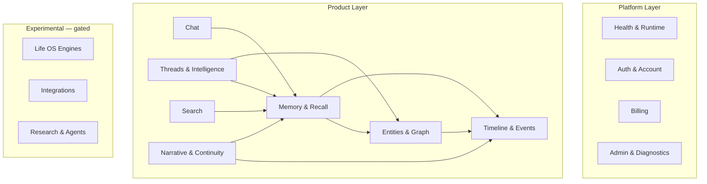

# LoreBook Canonical API Domain Map

**Audit date:** 2026-06-16  
**Purpose:** Define the canonical platform architecture. Every route must belong to exactly one domain.

---

## Design Principles

1. **One domain, one mount prefix** — no parallel `/api/timeline`, `/api/chronology`, `/api/timeline-v2` in production long-term
2. **CORE vs PLATFORM vs INTERNAL** — user-facing, partner-facing, operator-facing
3. **Auth at the domain boundary** — mount-level classification drives default auth; exceptions documented
4. **Response envelope at the domain boundary** — see Phase 4 below

---

## Canonical Domains



---

## Domain Definitions

### 1. Health & Runtime
**Canonical prefix:** `/api/health`, `/api/runtime`  
**Owns:** Liveness, readiness, schema health, route catalog  
**Must NOT own:** Wellness analytics (symptoms, sleep, energy) — move to `/api/wellness`

| Current Mount | Disposition |
| --- | --- |
| `GET /api/health` (index.ts inline) | **KEEP** — canonical liveness |
| `GET /health` | **DEPRECATE** — legacy non-api prefix |
| `/` + `/api/health` wellness routes (health.ts) | **MERGE → `/api/wellness`** |
| `/api/runtime/routes` | **KEEP** — internal catalog |

---

### 2. Auth & Account
**Canonical prefix:** `/api/user`, `/api/account`, `/api/security`, `/api/legal`, `/api/onboarding`, `/api/privacy`, `/api/verification`  
**Owns:** Profile, ToS, CSRF, privacy controls, onboarding  
**Auth default:** authenticated (public only for legal, csrf-token, onboarding pre-auth steps)

| Mount | Domain Role |
| --- | --- |
| `/api/user` | Profile, activity, storage, terms |
| `/api/account` | Export, delete |
| `/api/security` | CSRF token |
| `/api/legal` | Terms, privacy markdown |
| `/api/onboarding` | First-run flow |
| `/api/privacy` | Privacy settings, export, delete |
| `/api/verification` | Identity verification (experimental) |

---

### 3. Billing
**Canonical prefix:** `/api/subscription`  
**Owns:** Stripe subscription, usage limits, billing portal  
**Auth:** authenticated + webhook (public with Stripe signature)

| Route | Role |
| --- | --- |
| `GET /status`, `/usage` | User subscription state |
| `POST /create`, `/cancel`, `/reactivate` | Lifecycle |
| `POST /billing-portal` | Stripe portal |
| `POST /api/subscription/webhook` | Stripe events (index.ts) |

---

### 4. Chat
**Canonical prefix:** `/api/chat`  
**Owns:** Primary LLM interaction, streaming, feedback, message revisions  
**Auth:** authenticated (currently PUBLIC mount with optionalAuth — **fix to authenticated**)

| Current | Disposition |
| --- | --- |
| `/api/chat` | **KEEP** — canonical |
| `/api/chat/message` | **MERGE** into chat or rename to `/api/chat/orchestrate` |
| `/api/chat-memory` | **MERGE** into Memory domain session API |
| `/api/memory-engine` | **DELETE** after chat-memory merge (experimental alt chat) |

---

### 5. Threads & Intelligence
**Canonical prefix:** `/api/threads` (target) — today split across two mounts  
**Owns:** Thread CRUD, messages, titles, fork, status, thread intelligence, romantic relationships, what-changed, greeting

| Current Mount | Disposition |
| --- | --- |
| `/api/conversation` (64 routes) | **KEEP** — rename to `/api/threads` after merge |
| `/api/threads` (16 routes) | **MERGE** — timeline-node thread model absorbed into conversation router |
| `/api/continuity` | **KEEP** — narrative continuity (may merge under threads/intelligence subpath) |
| `/api/continuity-profile` | **MERGE** → `/api/threads/intelligence/profile` |

**Target structure:**
```
/api/threads                    # CRUD, messages, sync
/api/threads/:id/title           # Auto + manual titles
/api/threads/:id/status          # Pipeline status
/api/threads/:id/fork            # Fork thread
/api/threads/intelligence/*      # Traces, what-changed, greeting
/api/threads/relationships/*     # Romantic/social graph (from conversation)
```

---

### 6. Memory & Recall
**Canonical prefix:** `/api/memory` (target) — today fragmented  
**Owns:** Long-term claims, RAG retrieval, context assembly, working memory, review queue, corrections, canon

| Current Mount | Disposition |
| --- | --- |
| `/api/omega-memory` | **KEEP** → `/api/memory/claims` |
| `/api/memory-recall` | **KEEP** → `/api/memory/recall` |
| `/api/context` | **KEEP** → `/api/memory/context` |
| `/api/corrections` | **KEEP** → `/api/memory/corrections` |
| `/api/canon` | **KEEP** → `/api/memory/canon` |
| `/api/mrq` | **KEEP** → `/api/memory/review-queue` |
| `/api/memory-graph` | **MERGE** → `/api/memory/graph` |
| `/api/memory-ladder` | **DELETE** or merge |
| `/api/memory-engine` | **DELETE** (alt chat sessions) |
| `/api/consolidation` | **MERGE** → internal pipeline |
| `/api/knowledge` | **MERGE** → `/api/memory/knowledge` |
| `/api/graph` | **MERGE** → `/api/memory/graph` |
| `/api/perspectives` | **MERGE** → `/api/memory/perspectives` |

---

### 7. Entities & Graph
**Canonical prefix:** `/api/entities` (target) — today `/api/characters` is the real UI surface  
**Owns:** People, places, orgs, family trees, entity resolution, relationships, group candidates

| Current Mount | Disposition |
| --- | --- |
| `/api/characters` | **KEEP** — alias `/api/entities/people` long-term |
| `/api/locations` | **KEEP** → `/api/entities/places` |
| `/api/organizations` | **KEEP** → `/api/entities/organizations` |
| `/api/family-trees` | **KEEP** → `/api/entities/family-trees` |
| `/api/group-candidates` | **KEEP** → `/api/entities/group-candidates` |
| `/api/entities` | **EXPAND** — become router hub (certified-index, auto-update) |
| `/api/entity-resolution` | **KEEP** → `/api/entities/resolve` |
| `/api/entity-ambiguity` | **MERGE** |
| `/api/entity-meaning-drift` | **MERGE** |
| `/api/relationships` | **KEEP** → `/api/entities/relationships/infer` |

---

### 8. Timeline & Events
**Canonical prefix:** `/api/timeline` (single mount)  
**Owns:** Timelines, chronology, events, life arcs, chapters, temporal relationships

| Current Mount | Disposition |
| --- | --- |
| `/api/timeline-v2` | **KEEP** — absorb into `/api/timeline` (v2 becomes default) |
| `/api/timeline` (legacy read) | **DEPRECATE** — redirect to v2 |
| `/api/chronology` | **MERGE** → `/api/timeline/chronology` |
| `/api/timeline-hierarchy` | **MERGE** → `/api/timeline/hierarchy` |
| `/api/chapters` | **KEEP** → `/api/timeline/chapters` |
| `/api/life-arcs` | **KEEP** → `/api/timeline/arcs` |
| `/api/events` | **MERGE** → conversation events OR `/api/timeline/events` |
| `/api/conversation/events` | **KEEP** — primary event surface today |
| `/api/temporal-events` | **DELETE** |
| `/api/time` | **MERGE** → internal |
| `/api/evolution` | **KEEP** → `/api/timeline/evolution` |

---

### 9. Search
**Canonical prefix:** `/api/search`  
**Owns:** Universal semantic search across memory, entities, timeline

| Current | Disposition |
| --- | --- |
| `POST /api/search/universal` | **KEEP** — canonical |
| `GET /api/entries/search/keyword` | **MERGE** → `/api/search?mode=keyword&domain=entries` |
| `POST /api/memory-recall/query` | **MERGE** → `/api/search?mode=recall` |
| `POST /api/biography/search` | **MERGE** → `/api/search?domain=biography` |
| `/api/analytics/search` | **DELETE** — admin analytics only |

---

### 10. Narrative & Continuity
**Canonical prefix:** `/api/narrative`  
**Owns:** Summaries, contradictions, story coverage, biography (when promoted)

| Current | Disposition |
| --- | --- |
| `/api/narrative` | **KEEP** |
| `/api/summary` | **MERGE** → `/api/narrative/summary` |
| `/api/contradictions` | **KEEP** → `/api/narrative/contradictions` |
| `/api/contradiction-alerts` | **MERGE** with contradictions |
| `/api/belief-reconciliation` | **MERGE** |
| `/api/revealed-self` | **KEEP** → `/api/narrative/revealed-self` |
| `/api/biography` | **PROMOTE to CORE** when stable → `/api/narrative/biography` |

---

### 11. Skills & Growth (Product subdomains)
**Canonical prefixes:** `/api/skills`, `/api/perceptions`, `/api/achievements`  
**Owns:** Skill graph, perception engine, achievements  
**Status:** CORE or EXPERIMENTAL depending on mount; consolidate under `/api/growth/*` long-term

---

### 12. Admin & Diagnostics
**Canonical prefix:** `/api/admin`, `/api/diagnostics`, `/api/dev`  
**Owns:** Platform ops, health dashboards, dev tooling

| Mount | Audience | Auth |
| --- | --- | --- |
| `/api/admin` | Owner/admin | `requireAdmin` |
| `/api/diagnostics` | Mixed — see consolidation roadmap | per-route |
| `/api/dev` | Developer | `requireDevAccess` + ADMIN tier gate |
| `/api/analytics` | Admin | `requireAdmin` + ADMIN tier |
| `/api/correction-dashboard` | Admin | ADMIN tier |

---

### 13. Integrations (Experimental)
**Canonical prefix:** `/api/integrations`  
**Owns:** GitHub, Instagram, external hub ingest  
**Disposition:** Merge standalone `/api/github` into `/api/integrations/github`

---

### 14. Life OS Engines (Experimental bucket)
**Canonical prefix:** none today — 60+ experimental mounts  
**Owns:** Identity, emotions, goals, quests, RPG, dreams, habits, wisdom, etc.  
**Disposition:** Do not promote to CORE until domain owner assigned. Group under `/api/engines/{name}` or keep gated.

---

## Domain Ownership Matrix

| Domain | Owner Team | Stability | Public API Candidate |
| --- | --- | --- | --- |
| Chat | Platform | High | No (product-locked) |
| Threads | Platform | High | Thread Intelligence API (future) |
| Memory | Platform | Medium | **Memory API** (high value) |
| Entities | Platform | Medium | **Entity API** (high value) |
| Timeline | Platform | Low (fragmented) | **Timeline API** (medium) |
| Search | Platform | Medium | Search API (medium) |
| Relationships | Platform | Medium | **Relationship API** (high) |
| Billing | Platform | High | No |
| Admin | Internal | High | No |
| Life OS Engines | Research | Low | No |

---

## Phase 4 — Response Standardization

### Target: `CanonicalResponse`

**Success:**
```json
{
  "success": true,
  "data": { }
}
```

**Failure:**
```json
{
  "success": false,
  "error": {
    "code": "NOT_FOUND",
    "message": "Human-readable message"
  }
}
```

**Pagination:**
```json
{
  "success": true,
  "data": [ ],
  "pagination": {
    "cursor": "...",
    "hasMore": true,
    "total": 100
  }
}
```

### Current Deviations (audit)

| Pattern | Example Routes | Count (est.) |
| --- | --- | ---: |
| Raw domain object | Most CORE routes | ~600 |
| `{ success: true, ...fields }` | relationships, groupCandidates, timeline mutations, intelligence-health | ~80 |
| `{ error: "string" }` | Global errorHandler, ad-hoc catches | ~891 (errors) |
| `{ error, details }` | Zod validation | middleware |
| `{ status: "ok" }` | health, diagnostics root | ~5 |
| `{ ok: true }` | runtime/routes | 1 |
| `{ authority: {...} }` | subscription/status | 1 |
| `{ messages: [...] }` | chat orchestration | 1 |
| No envelope + mixed field names | conversation, characters, entries | dominant |

### Standardization Plan

| Priority | Action |
| --- | --- |
| P0 | Adopt envelope in **new routes only**; add `sendSuccess()` / `sendError()` helpers |
| P1 | Migrate **public API candidates** (memory, entities, timeline) first |
| P2 | Add response adapter middleware for legacy routes (dual-write `{ data }` wrapper) |
| P3 | Breaking migration with `/api/v2` prefix for external consumers |

### Error Code Taxonomy (proposed)

| Code | HTTP | Use |
| --- | --- | --- |
| `UNAUTHORIZED` | 401 | Missing/invalid auth |
| `FORBIDDEN` | 403 | Auth ok, insufficient role/tenant |
| `NOT_FOUND` | 404 | Resource or route |
| `VALIDATION_ERROR` | 400 | Zod/body validation |
| `RATE_LIMITED` | 429 | Rate limit |
| `FEATURE_DISABLED` | 503 | Experimental gate |
| `INTERNAL_ERROR` | 500 | Unhandled |

---

## Mount → Domain Assignment (All 152 Mounts)

Every mount maps to exactly one canonical domain:

| Domain | Mounts |
| --- | --- |
| **Health & Runtime** | `/`, `/api/health`, `/api/runtime` |
| **Auth & Account** | `/api/user`, `/api/account`, `/api/security`, `/api/legal`, `/api/onboarding`, `/api/privacy`, `/api/verification` |
| **Billing** | `/api/subscription` |
| **Chat** | `/api/chat`, `/api/chat/message`, `/api/chat-memory`, `/api/memory-engine` |
| **Threads & Intelligence** | `/api/conversation`, `/api/threads`, `/api/continuity`, `/api/continuity-profile` |
| **Memory & Recall** | `/api/omega-memory`, `/api/memory-recall`, `/api/context`, `/api/corrections`, `/api/canon`, `/api/mrq`, `/api/memory-graph`, `/api/memory-ladder`, `/api/consolidation`, `/api/knowledge`, `/api/graph`, `/api/perspectives`, `/api/insights` |
| **Entities & Graph** | `/api/characters`, `/api/entities`, `/api/entity-*`, `/api/organizations`, `/api/family-trees`, `/api/group-candidates`, `/api/locations`, `/api/location-resolution`, `/api/people-places`, `/api/relationships`, `/api/temporal-relationships`, `/api/relationship-dynamics` |
| **Timeline & Events** | `/api/timeline`, `/api/timeline-v2`, `/api/timeline-hierarchy`, `/api/chronology`, `/api/chapters`, `/api/life-arcs`, `/api/life`, `/api/events`, `/api/temporal-events`, `/api/time`, `/api/evolution`, `/api/activities`, `/api/calendar` |
| **Search** | `/api/search`, `/api/hqi` |
| **Narrative & Continuity** | `/api/narrative`, `/api/summary`, `/api/contradictions`, `/api/contradiction-alerts`, `/api/belief-reconciliation`, `/api/revealed-self`, `/api/biography`, `/api/memoir`, `/api/naming`, `/api/backward-storytelling`, `/api/narrative-diff` |
| **Skills & Growth** | `/api/skills`, `/api/perceptions`, `/api/reactions`, `/api/perception-reaction-engine`, `/api/achievements`, `/api/resume` |
| **Admin & Diagnostics** | `/api/admin`, `/api/diagnostics`, `/api/dev`, `/api/analytics`, `/api/correction-dashboard`, `/api/counts` |
| **Ingestion** | `/api/entries`, `/api/documents`, `/api/photos` |
| **Integrations** | `/api/integrations`, `/api/github`, `/api/external-hub`, `/api/x`, `/api/harmonization` |
| **Life OS Engines** | All remaining EXPERIMENTAL mounts (identity, emotions, goals, quests, rpg, dreams, habits, wisdom, learning, prediction, voids, engines, meta, strategy, bias-ethics, etc.) |
| **Research** | `/api/orchestrator`, `/api/autopilot`, `/api/agents` |

---

## Target Platform URL Structure (North Star)

```
/api/v1/chat/*
/api/v1/threads/*
/api/v1/memory/*
/api/v1/entities/*
/api/v1/timeline/*
/api/v1/search/*
/api/v1/narrative/*
/api/v1/account/*
/api/v1/billing/*

/internal/admin/*
/internal/diagnostics/*
/internal/dev/*
```

Version prefix introduced only when external LoreBook API launches. Until then, consolidate mounts without breaking `/api/{domain}` clients.
