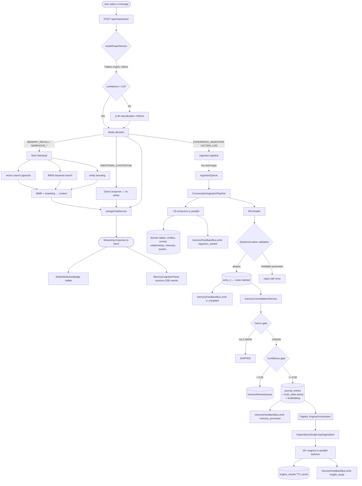
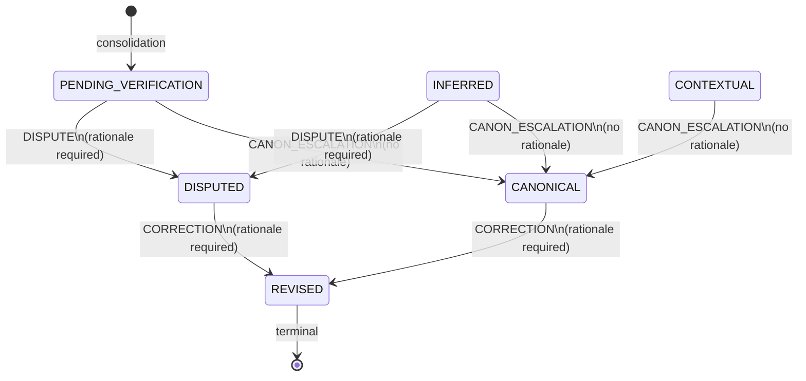
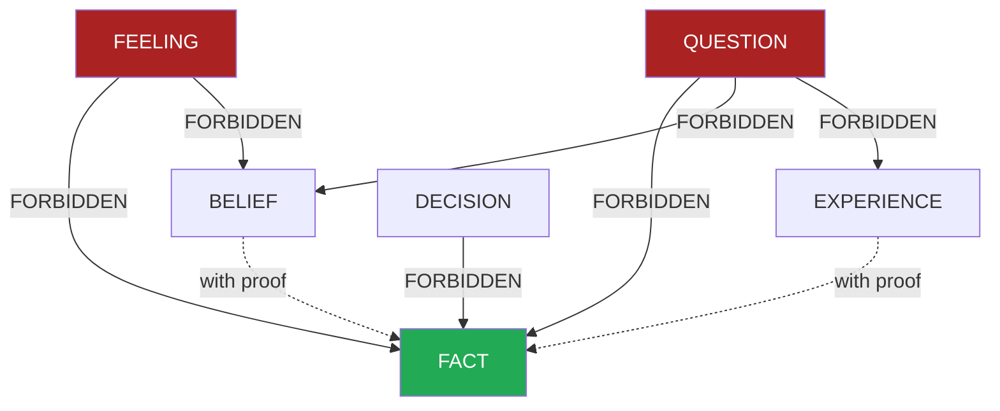
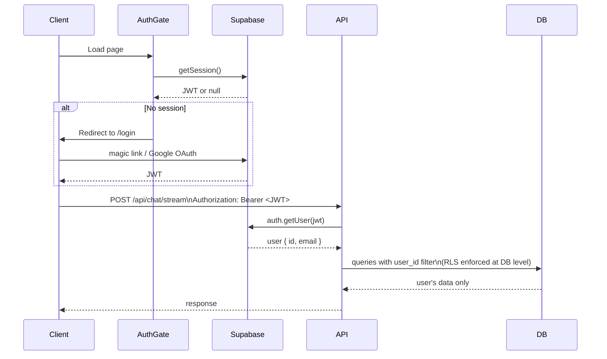

# Lorekeeper — System Map

This document maps the complete cognition lifecycle, event flow, service boundaries, and ontological domains.

---

## Full Cognition Lifecycle



---

## Truth-State Transition Graph



Every transition fires a write to `cognition_mutations` (append-only).

---

## Epistemic Knowledge Type Lattice



Downgrades (FACT → BELIEF, FACT → EXPERIENCE) are always allowed.
Forbidden edges are absolute — no proof can override them.

---

## Service Ownership Map

```
┌─────────────────────────────────────────────────────────────────────┐
│  INPUT LAYER                                                        │
│  modeRouterService — owns mode decision                             │
│  rateLimitMiddleware — owns request throttle                        │
│  requireAuth / optionalAuth — owns identity assertion              │
└───────────────────────────┬─────────────────────────────────────────┘
                            │
┌───────────────────────────▼─────────────────────────────────────────┐
│  CHAT LAYER                                                         │
│  omegaChatService — owns response generation                        │
│  systemPromptBuilder — owns prompt assembly                         │
│  ragBuilderService — owns retrieval context construction            │
│  tokenBudgetService — owns context window budgeting                 │
│  compactionService — owns conversation compaction                   │
└───────────────────────────┬─────────────────────────────────────────┘
                            │
┌───────────────────────────▼─────────────────────────────────────────┐
│  INGESTION LAYER                                                    │
│  ConversationIngestionPipeline — owns the full extraction pass      │
│  ~30 extractors — each owns one domain artifact type               │
│  memoryFeedbackBus — owns event emission to frontend               │
└───────────────────────────┬─────────────────────────────────────────┘
                            │
┌───────────────────────────▼─────────────────────────────────────────┐
│  COMPILER LAYER  (LNC)                                              │
│  IRCompiler — owns utterance → EntryIR                             │
│  EpistemicLattice — owns promotion rules                           │
│  EpistemicInvariants — owns forbidden-edge enforcement             │
│  CanonDetectionService — owns reality boundary classification      │
└───────────────────────────┬─────────────────────────────────────────┘
                            │
┌───────────────────────────▼─────────────────────────────────────────┐
│  CONSOLIDATION LAYER                                                │
│  MemoryConsolidationService — owns IR → journal_entry promotion    │
│  EmbeddingService — owns vector generation                         │
│  TruthStateFromConsolidation — owns initial epistemic stamp        │
└───────────────────────────┬─────────────────────────────────────────┘
                            │
┌───────────────────────────▼─────────────────────────────────────────┐
│  GOVERNANCE LAYER                                                   │
│  CorrectionAuthority — owns truth-state transitions                │
│  cognition_mutations — owns immutable audit history               │
│  RLS policies — own ownership enforcement at DB level              │
└───────────────────────────┬─────────────────────────────────────────┘
                            │
┌───────────────────────────▼─────────────────────────────────────────┐
│  ENGINE LAYER                                                       │
│  EngineOrchestrator — owns dependency-ordered execution            │
│  DependencyGraph — owns cycle detection + parallel scheduling      │
│  40+ engines — each owns one analytical domain                     │
│  SensemakingOrchestrator — owns adaptive engine selection          │
└───────────────────────────┬─────────────────────────────────────────┘
                            │
┌───────────────────────────▼─────────────────────────────────────────┐
│  RETRIEVAL LAYER                                                    │
│  RAGBuilderService — owns hybrid retrieval assembly                │
│  EmbeddingCacheService — owns TinyLFU + DB embedding cache         │
│  VectorSearch — owns pgvector similarity                           │
│  EntityRegistry — owns canonical entity resolution                 │
└─────────────────────────────────────────────────────────────────────┘
```

---

## Ontological Domains (Table Map)

The 283 tables are organized into these ontological domains:

### Cognition core
`journal_entries`, `entry_ir`, `knowledge_units`, `utterances`, `cognition_mutations`

### Identity & self
`omega_entities`, `entities`, `identityCore_*`, `archetype_*`, `personality_*`, `essence_*`, `shadow_*`

### Relationships & entities
`characters`, `people_places`, `relationship_*`, `entity_resolution_cache`, `entity_*`

### Timeline & narrative
`timeline_*` (9-level hierarchy: mythos → eras → sagas → arcs → chapters → scenes → actions → microactions → search_index), `chapters`, `temporal_*`

### Emotional & behavioral
`emotion_*`, `moods`, `biometric_measurements`, `behavior_*`, `workout_events`, `health_*`

### Memory & retrieval
`embeddings_cache`, `memory_*`, `conversation_*`, `chat_messages`, `threads`

### Analytics & engines
`engine_*`, `continuity_*`, `insights`, `predictions`

### Life domains
`goals`, `decisions`, `values`, `habits`, `skills`, `financial_*`, `learning_*`

### Infrastructure
`auth.users` (Supabase-managed), `rls policies`, `indexes`

---

## Event Flow: Chat Message to Memory

```
t=0ms    POST /api/chat/stream arrives
t=1ms    requireAuth / optionalAuth resolves user identity
t=5ms    modeRouterService.quickModeCheck() — pattern matching
t=50ms   [if needed] modeRouterService.llmModeCheck()
t=60ms   RAG retrieval begins (if MEMORY_RECALL)
t=100ms  omegaChatService starts streaming response to client
         [client sees first tokens]
t=200ms  ingestionQueue.enqueue() fires — pipeline starts async
t=300ms  SSE: memoryFeedbackBus 'ingestion_started' → MemoryCognitionPanel
t=500ms  ~30 extractors complete — domain tables written
t=600ms  irCompiler.compileUtteranceToIR() — EntryIR written
t=650ms  SSE: 'ir_compiled' → MemoryCognitionPanel updates
t=700ms  memoryConsolidationService.consolidate() — journal_entry written
t=750ms  embeddingService generates vector — entry becomes retrievable
t=800ms  SSE: 'memory_promoted' → MemoryCognitionPanel shows "written to memory"
         [nightly] engineRuntime.runAll() — insights generated
```

---

## Frontend Surface Map

```
/                           → Chat (default)
/chat                       → Chat
/chat/:threadId             → Chat (specific thread)
/timeline                   → Timeline surface
/memories                   → Memory explorer
/entities                   → Entity surface
/memoir                     → Memoir surface
/lorebook                   → Lorebook surface
/search                     → Search
/what-ai-knows              → Identity transparency (WhatAIKnows page)
/account                    → Account center
/security                   → Privacy & security settings
/subscription               → Subscription management
/admin                      → Admin (protected)
/dev-console                → Dev console (dev only)
```

### Cognition UI components

```
ModeAttributionBadge        Mode decision with emotional language
                            Location: below every assistant message
                            Data: modeDecision from chat response

MemoryCognitionPanel        Real-time pipeline feedback
                            Location: expandable below messages
                            Data: SSE events from memoryFeedbackBus

CognitionMetaPanel          Dev-mode mode router + RAG stats
                            Location: collapsible in chat
                            Data: modeDecision + ragStats from response

NarrativeStoryPanel         Narrative synthesis output
                            Location: when mode = NARRATIVE_STORY
                            Data: storyOfSelf engine output

WhatAIKnows (/what-ai-knows)
                            Full transparency surface
                            Memories, insights, entities, audit log
                            Inline revision via CorrectionAuthority
```

---

## Auth Flow



---

## Dependency Graph: Key Engine Dependencies

The `DependencyGraph` in `services/compiler/dependencyGraph.ts` and the engine orchestrator enforce execution order. Notable dependencies:

```
identityCore
    └── archetype
            └── personality
                    └── shadow
                            └── alternateSelf

entities (entityResolution)
    ├── social (socialNetworkEngine)
    │       └── socialProjection
    ├── scenes
    └── conflicts

continuity
    ├── chronology
    └── storyOfSelf
            └── innerMythology
```

Engines with no dependencies run first in parallel. Dependent engines wait for their prerequisites. The maximum concurrency is 5 (configurable in `EngineOrchestrator` constructor).

---

## Provenance Chain Example

For a journal entry "I decided to leave my job":

```
utterance (source)
    │  EXTRACTED_FROM
    ▼
entry_ir (knowledge_type=DECISION, canon=CANON, confidence=0.82)
    │  COMPILED_INTO
    ▼
journal_entry (truth_state=CANONICAL)
    │  (user revises: "I never actually decided, I was forced out")
    ▼
cognition_mutation (CORRECTION, rationale="I was laid off, not a decision")
    │  REVISED_BY
    ▼
journal_entry (truth_state=REVISED)
    + new journal_entry (truth_state=PENDING_VERIFICATION)
          │  INFERRED_FROM
          ▼
      insight: "You may have framed an involuntary event as a decision"
```

> **Note:** The `REVISED_BY` and `INFERRED_FROM` provenance edges shown here are the design intent. The `ProvenanceEdge` type and `makeProvenanceEdge()` exist, but the `provenance_edges` table persistence is not yet implemented. The chain is currently reconstructable only by joining `cognition_mutations` records — it is not a traversable graph.
