# ER Diagram: Engine Runtime Domain

> Generated from `information_schema` on the live local Supabase DB (283 tables).

This diagram covers the **reflective analysis infrastructure** — the ~40 async engines
that run as a DAG, analyze memory state, and write typed insights back to the DB.

```mermaid
erDiagram
    %% ── Engine registry and DAG ────────────────────────────────────────────
    engine_manifest {
        uuid id PK
        text name              "unique engine identifier"
        text category          "identity | narrative | social | wellness | ..."
        text status            "active | disabled | experimental"
        text version
        text description
    }

    engine_dependencies {
        uuid id PK
        text engine_name FK    "→ engine_manifest.name"
        text depends_on FK     "→ engine_manifest.name"
    }

    engine_blueprints {
        uuid id PK
        uuid engine_id FK
        text blueprint         "prompt template or config"
        text format            "text | json | structured"
    }

    engine_embeddings {
        uuid id PK
        uuid engine_id FK
        vector embedding
        int  tokens
    }

    %% ── Execution tracking ─────────────────────────────────────────────────
    engine_runs {
        uuid id PK
        uuid user_id
        text engine_name FK
        bool success
        int  duration_ms
        int  output_count
        numeric avg_confidence
        text error
        timestamptz run_time
    }

    engine_health {
        uuid id PK
        text engine_name FK
        timestamptz last_run
        timestamptz last_success
        text last_error
        int  average_duration_ms
        bigint run_count
        bigint error_count
    }

    engine_results {
        uuid id PK
        uuid user_id
        jsonb results          "keyed by engine name — latest output per user"
        timestamptz updated_at
    }

    %% ── Identity engine outputs ────────────────────────────────────────────
    identity_core_profiles {
        uuid id PK
        uuid user_id
        jsonb dimensions       "compiled identity dimensions"
        jsonb conflicts
        jsonb stability
        jsonb projection
        text summary
    }

    identity_timeline_events {
        uuid id PK
        uuid user_id
        uuid profile_id FK
        text event_type
        text description
        timestamptz timestamp
    }

    %% ── Archetype engine outputs ───────────────────────────────────────────
    archetype_profiles {
        uuid id PK
        uuid user_id
        text dominant
        text[] secondary
        text shadow
        jsonb distribution
    }

    archetype_signals {
        uuid id PK
        uuid user_id
        uuid entry_id FK       "→ journal_entries"
        text label
        double confidence
        text evidence
        timestamptz timestamp
    }

    archetype_transitions {
        uuid id PK
        uuid user_id
        text from_archetype
        text to_archetype
        double weight
        text[] evidence
        timestamptz timestamp
    }

    archetype_distortions {
        uuid id PK
        uuid user_id
        text archetype
        text distortion
        double confidence
        text[] indicators
        timestamptz timestamp
    }

    %% ── Values engine outputs ──────────────────────────────────────────────
    values {
        uuid id PK
        uuid user_id
        text name
        text description
        double priority
        timestamptz ended_at   "NULL = still active"
    }

    value_signals {
        uuid id PK
        uuid user_id
        text category
        double strength
        text text
        uuid entry_id
        timestamptz timestamp
    }

    value_rankings {
        uuid id PK
        uuid user_id
        uuid value_id FK
        int  rank
        double score
        double frequency_score
        double recency_score
        double sentiment_score
        timestamptz calculated_at
    }

    value_priority_history {
        uuid id PK
        uuid value_id FK
        uuid user_id
        double priority
        int  rank
        text reason
        text source
    }

    value_evolution_events {
        uuid id PK
        uuid user_id
        uuid value_id FK
        text event_type
        double old_priority
        double new_priority
        int  old_rank
        int  new_rank
        text description
        jsonb evidence
    }

    %% ── Growth engine outputs ──────────────────────────────────────────────
    growth_signals {
        uuid id PK
        uuid user_id
        text domain
        double intensity
        int  direction         "-1 | 0 | 1"
        text text
        uuid entry_id
        timestamptz timestamp
    }

    growth_insights {
        uuid id PK
        uuid user_id
        text type
        text message
        text domain
        double confidence
        timestamptz timestamp
    }

    growth_trajectory_points {
        uuid id PK
        uuid user_id
        text domain
        double value
        timestamptz timestamp
    }

    %% ── General insights (cross-engine) ────────────────────────────────────
    insights {
        uuid id PK
        uuid user_id
        text type
        text title
        text description
        double confidence
        text scope
        uuid[] related_entity_ids
        uuid[] related_claim_ids
        jsonb time_window
        bool dismissed
        timestamptz generated_at
    }

    %% ── Essence / soul engine outputs ──────────────────────────────────────
    essence_profiles {
        uuid id PK
        uuid user_id
        jsonb profile_data     "compiled soul/essence snapshot"
        int  version
    }

    %% ── Relationships ──────────────────────────────────────────────────────
    engine_manifest  ||--o{ engine_dependencies  : "depends on (source)"
    engine_manifest  ||--o{ engine_dependencies  : "required by (target)"
    engine_manifest  ||--o{ engine_blueprints    : "has blueprint"
    engine_manifest  ||--o{ engine_embeddings    : "embedded as"
    engine_manifest  ||--o{ engine_health        : "health tracked"
    engine_manifest  ||--o{ engine_runs          : "run history"

    identity_core_profiles ||--o{ identity_timeline_events : "tracks changes"

    values           ||--o{ value_rankings          : "ranked"
    values           ||--o{ value_priority_history  : "priority history"
    values           ||--o{ value_evolution_events  : "evolves via"
```



## Engine categories at a glance

| Category | Engines (representative) | Output tables |
|---|---|---|
| Identity | identityCore, archetype, shadow | `identity_core_profiles`, `archetype_profiles`, `archetype_signals` |
| Values | valueEvolution, valueRanking | `values`, `value_rankings`, `value_evolution_events` |
| Narrative | narrativeGraph, continuity | `narrative_graphs`, `continuity_events`, `continuity_profiles` |
| Social | socialGraph, relationship | `social_nodes`, `social_edges`, `temporal_edges` |
| Wellness | resilience, mood, energy | `resilience_insights`, `wellness_scores`, `energy_curve_points` |
| Growth | growth, habit, skill | `growth_signals`, `growth_trajectory_points`, `skill_progress` |
| Cognitive | bias, cognitive distortions | `bias_detections`, `cognitive_distortions` |
| Creative | creative, inspiration | `creative_insights`, `creative_events` |

## Execution model

```
Scheduler (daily @ 2 AM or on-demand)
  └─ DAG resolver reads engine_dependencies
       └─ Topological sort → execution order
            └─ Each engine:  reads memory state → generates insight → writes to its output table
                             records in engine_runs (duration, count, confidence)
                             updates engine_health (last_run, error_count)
                             writes latest to engine_results (jsonb keyed by engine name)
```
