# ER Diagram: Identity & Social Domain

> Generated from `information_schema` on the live local Supabase DB (283 tables).

This diagram covers **persistent identity and social graph modeling** — how the system
tracks who the user is, who they know, and how both change over time.

```mermaid
erDiagram
    %% ── Identity substrate ─────────────────────────────────────────────────
    identity_core_profiles {
        uuid id PK
        uuid user_id
        jsonb dimensions       "compiled identity axes: agency, openness, ..."
        jsonb conflicts        "active identity conflicts"
        jsonb stability        "stability metrics per dimension"
        jsonb projection       "projected trajectory"
        text summary
        timestamptz created_at
        timestamptz updated_at
    }

    identity_signals {
        uuid id PK
        uuid user_id
        uuid memory_id FK      "→ journal_entries"
        text type              "trait | value | belief | behavior | emotion"
        text text
        text evidence
        double weight
        double confidence
        vector embedding
        timestamptz timestamp
    }

    essence_profiles {
        uuid id PK
        uuid user_id
        jsonb profile_data     "soul-layer snapshot: drives, fears, gifts"
        int  version
    }

    %% ── Values ─────────────────────────────────────────────────────────────
    values {
        uuid id PK
        uuid user_id
        text name
        double priority
        timestamptz ended_at   "NULL = currently held"
    }

    value_rankings {
        uuid id PK
        uuid user_id
        uuid value_id FK
        int  rank
        double score
        double frequency_score
        double recency_score
        double sentiment_score
        timestamptz calculated_at
    }

    value_evolution_events {
        uuid id PK
        uuid user_id
        uuid value_id FK
        text event_type
        double old_priority
        double new_priority
        int  old_rank
        int  new_rank
        text description
    }

    %% ── Beliefs / commitments ──────────────────────────────────────────────
    profile_claims {
        uuid id PK
        uuid user_id
        text claim_text
        text domain
        double confidence
    }

    profile_claim_evidence {
        uuid id PK
        uuid claim_id FK
        text evidence_text
        text source
        double weight
    }

    %% ── Social graph ───────────────────────────────────────────────────────
    social_nodes {
        uuid id PK
        uuid user_id
        text node_type         "person | group | community"
        text name
        jsonb metadata
    }

    social_edges {
        uuid id PK
        uuid user_id
        text edge_type         "knows | close | family | colleague | ..."
        double strength
        bool is_active
        timestamptz started_at
        timestamptz ended_at
    }

    temporal_edges {
        uuid id PK
        uuid user_id
        text edge_type
        text status
        timestamptz start_date
        timestamptz end_date
    }

    relationship_snapshots {
        uuid id PK
        uuid relationship_id FK  "→ temporal_edges"
        jsonb snapshot_data
        timestamptz captured_at
    }

    %% ── Romantic relationships (dedicated sub-graph) ───────────────────────
    romantic_relationships {
        uuid id PK
        uuid user_id
        text status            "active | ended | complicated"
        timestamptz start_date
        timestamptz end_date
    }

    relationship_analytics {
        uuid id PK
        uuid relationship_id FK
        jsonb metrics
        timestamptz calculated_at
    }

    relationship_drift {
        uuid id PK
        uuid relationship_id FK
        double drift_score
        text direction
        timestamptz measured_at
    }

    relationship_cycles {
        uuid id PK
        uuid relationship_id FK
        text cycle_type
        text description
        int  occurrence_count
    }

    relationship_breakups {
        uuid id PK
        uuid relationship_id FK
        text reason_category
        text narrative
        timestamptz occurred_at
    }

    romantic_interactions {
        uuid id PK
        uuid relationship_id FK
        text interaction_type
        double quality_score
        timestamptz occurred_at
    }

    romantic_dates {
        uuid id PK
        uuid relationship_id FK
        text location
        double quality_score
        timestamptz occurred_at
    }

    %% ── Characters (named people in the user's story) ──────────────────────
    characters {
        uuid id PK
        uuid user_id
        text name
        text type              "person | archetype | fictional"
        jsonb metadata
    }

    character_relationships {
        uuid id PK
        uuid source_character_id FK
        uuid target_character_id FK
        text relationship_type
        uuid last_shared_memory_id FK
    }

    character_memories {
        uuid id PK
        uuid character_id FK
        uuid journal_entry_id FK
        uuid chapter_id FK
        text role
    }

    %% ── Social influence ───────────────────────────────────────────────────
    influence_events {
        uuid id PK
        uuid user_id
        text influencer
        text domain
        double intensity
        text direction
        timestamptz timestamp
    }

    influence_scores {
        uuid id PK
        uuid user_id
        text influencer
        double score
        double recency_weight
        timestamptz calculated_at
    }

    person_influence {
        uuid id PK
        uuid user_id
        text person_name
        text influence_type
        double score
        timestamptz updated_at
    }

    inferred_relationships {
        uuid id PK
        uuid user_id
        text from_person
        text to_person
        text relationship_type
        double confidence
        text[] evidence
    }

    %% ── Relationships ──────────────────────────────────────────────────────
    identity_core_profiles ||--o{ identity_signals      : "built from"
    identity_signals        }o--|| journal_entries       : "sourced from"

    values                  ||--o{ value_rankings        : "ranked by"
    values                  ||--o{ value_evolution_events : "evolves via"

    profile_claims          ||--o{ profile_claim_evidence : "evidenced by"

    temporal_edges          ||--o{ relationship_snapshots : "snapshotted"
    romantic_relationships  ||--o{ relationship_analytics : "analyzed"
    romantic_relationships  ||--o{ relationship_drift     : "drift tracked"
    romantic_relationships  ||--o{ relationship_cycles    : "cycles identified"
    romantic_relationships  ||--o{ relationship_breakups  : "ended via"
    romantic_relationships  ||--o{ romantic_interactions  : "interactions logged"
    romantic_relationships  ||--o{ romantic_dates         : "dates logged"

    characters              ||--o{ character_relationships : "relates (source)"
    characters              ||--o{ character_relationships : "relates (target)"
    characters              ||--o{ character_memories      : "appears in"
```

## Identity modeling philosophy

The system distinguishes three identity layers:

| Layer | Tables | What it captures |
|---|---|---|
| **Signals** | `identity_signals` | Raw, weighted evidence from individual entries |
| **Compiled profile** | `identity_core_profiles` | Aggregated across all signals — the engine's view of who you are |
| **Essence** | `essence_profiles` | Soul-level synthesis: core drives, fears, gifts, contradictions |

Values are **temporally scoped** (`ended_at` = NULL means currently held), so the system
can track how your values have shifted over months and years — not just what you value now.

The social graph runs on two layers:
- `social_nodes/edges` — abstract graph (knows, close, family...)
- `characters` + `character_memories` — narrative-layer people who appear in your story
