# ER Diagram: Memory Domain

> Generated from `information_schema` on the live local Supabase DB (283 tables).  
> Regenerate any time with: `psql -h 127.0.0.1 -p 54322 -U postgres -d postgres`

This diagram covers the **cognitive ingestion topology** — how raw input becomes
structured, epistemically-typed, searchable memory.

```mermaid
erDiagram
    %% ── Core entry (root of the ingestion graph) ──────────────────────────
    journal_entries {
        uuid id PK
        uuid user_id
        text content
        text source           "chat | journal | import"
        text content_type     "EXPERIENCE | FEELING | BELIEF | FACT | DECISION | QUESTION"
        text knowledge_type
        text verification_status
        double sentiment
        text mood
        text pattern_type
        uuid derived_from_entry_id FK
        text embedding_model
        int  embedding_version
        vector embedding
        timestamptz date
        timestamptz created_at
    }

    %% ── Compiled IR components ─────────────────────────────────────────────
    memory_components {
        uuid id PK
        uuid journal_entry_id FK
        text component_type   "scene | emotion | fact | decision | belief"
        text text
        text[] characters_involved
        text location
        int  importance_score
        vector embedding
        timestamptz timestamp
    }

    knowledge_units {
        uuid id PK
        uuid user_id
        uuid utterance_id
        text knowledge_type   "EXPERIENCE | FEELING | BELIEF | FACT | DECISION | QUESTION"
        text canon_status     "CANON | ROLEPLAY | HYPOTHETICAL | FICTIONAL"
        text content
        double confidence
        text certainty_source
        text temporal_scope
        jsonb entities
        text[] emotions
        text[] themes
    }

    %% ── Entity layer ───────────────────────────────────────────────────────
    omega_entities {
        uuid id PK
        uuid user_id
        text type             "PERSON | PLACE | CONCEPT | ORGANIZATION | EVENT"
        text primary_name
        text[] aliases
        vector embedding
    }

    omega_claims {
        uuid id PK
        uuid entity_id FK
        uuid user_id
        text text
        text source
        double confidence
        text sentiment
        bool is_active
        vector embedding
        timestamptz start_time
        timestamptz end_time
    }

    omega_relationships {
        uuid id PK
        uuid from_entity_id FK
        uuid to_entity_id FK
        uuid user_id
        text type
        double confidence
        bool is_active
        timestamptz start_time
        timestamptz end_time
    }

    omega_evidence {
        uuid id PK
        uuid claim_id FK
        uuid user_id
        text content
        text source
        text source_type
        double reliability_score
        timestamptz timestamp
    }

    entity_mentions {
        uuid id PK
        uuid entity_id FK
        uuid memory_id FK      "→ journal_entries"
        uuid user_id
        text raw_text
    }

    %% ── Fact extraction ────────────────────────────────────────────────────
    fact_claims {
        uuid id PK
        uuid entry_id FK
        uuid user_id
        text claim_type
        text subject
        text attribute
        text value
        double confidence
        jsonb metadata
    }

    %% ── Conversation layer ─────────────────────────────────────────────────
    conversation_sessions {
        uuid id PK
        uuid user_id
        text title
        text summary
        vector embeddings
        text[] topics
        timestamptz started_at
        timestamptz ended_at
    }

    conversation_messages {
        uuid id PK
        uuid session_id FK
        uuid user_id
        text role             "user | assistant"
        text content
        jsonb metadata
        timestamptz created_at
    }

    conversation_compactions {
        uuid id PK
        uuid user_id
        text session_id
        text compaction_type  "sliding_window | summary | full"
        int  turn_range_start
        int  turn_range_end
        int  original_tokens
        int  summary_tokens
        double compression_ratio
        text summary
        text model_used
        text[] key_entities
        text[] key_topics
        timestamptz created_at
        timestamptz expires_at
    }

    %% ── Identity signals ───────────────────────────────────────────────────
    identity_signals {
        uuid id PK
        uuid user_id
        uuid memory_id FK
        text type
        text text
        text evidence
        double weight
        double confidence
        vector embedding
        timestamptz timestamp
    }

    thought_classifications {
        uuid id PK
        uuid user_id
        uuid entry_id FK
        text thought_text
        text thought_type
        double confidence
    }

    insecurity_patterns {
        uuid id PK
        uuid user_id
        text theme
        text domain
        int  frequency
        text intensity_trend
        double average_intensity
        text[] related_themes
        jsonb context_patterns
    }

    insecurity_instances {
        uuid id PK
        uuid user_id
        uuid pattern_id FK
        uuid entry_id FK
        uuid thought_id FK
        double intensity
        text domain
        text comparison_target
    }

    %% ── Memory graph ───────────────────────────────────────────────────────
    graph_edges {
        uuid id PK
        uuid source_component_id FK
        uuid target_component_id FK
    }

    %% ── Relationships ──────────────────────────────────────────────────────
    journal_entries ||--o{ memory_components       : "compiled into"
    journal_entries ||--o{ entity_mentions         : "mentions"
    journal_entries ||--o{ fact_claims             : "asserts"
    journal_entries ||--o{ identity_signals        : "signals identity via"
    journal_entries ||--o{ thought_classifications : "classified into"
    journal_entries ||--o{ insecurity_instances    : "surfaces"
    journal_entries }o--o| journal_entries         : "derived_from"

    omega_entities  ||--o{ omega_claims            : "has claims about"
    omega_entities  ||--o{ omega_relationships     : "related from"
    omega_entities  ||--o{ omega_relationships     : "related to"
    omega_claims    ||--o{ omega_evidence          : "supported by"
    omega_entities  ||--o{ entity_mentions         : "referenced in"

    fact_claims     ||--o{ fact_verifications      : "verified by"

    conversation_sessions  ||--o{ conversation_messages    : "contains"
    conversation_sessions  ||--o{ conversation_compactions : "compacted into"

    memory_components ||--o{ graph_edges : "source"
    memory_components ||--o{ graph_edges : "target"

    insecurity_patterns ||--o{ insecurity_instances : "instantiated as"
    thought_classifications ||--o{ insecurity_instances : "triggers"
```

## Table roles at a glance

| Table | Semantic role |
|---|---|
| `journal_entries` | Root ingestion unit — every message and entry lands here |
| `memory_components` | IR decomposition — entry split into typed semantic chunks |
| `knowledge_units` | Epistemic atoms — typed EXPERIENCE/BELIEF/FACT/DECISION/QUESTION |
| `omega_entities` | Resolved entity registry — deduped across all entries |
| `omega_claims` | Temporally-scoped claims about an entity |
| `omega_relationships` | Edges between entities with confidence + lifespan |
| `omega_evidence` | Evidence records supporting individual claims |
| `entity_mentions` | Raw-text surface forms linking entries to resolved entities |
| `fact_claims` | Subject-attribute-value triples extracted per entry |
| `conversation_sessions` | Chat session envelope with summary embedding |
| `conversation_messages` | Individual turns within a session |
| `conversation_compactions` | Compressed summaries when token budget exceeded |
| `identity_signals` | Weighted identity-relevant moments extracted from entries |
| `thought_classifications` | Thought-type labels (CBT-style) per entry |
| `insecurity_patterns` | Recurring insecurity themes aggregated over time |
| `insecurity_instances` | Individual occurrences of a pattern in a specific entry |
| `graph_edges` | Memory component graph for associative retrieval |
