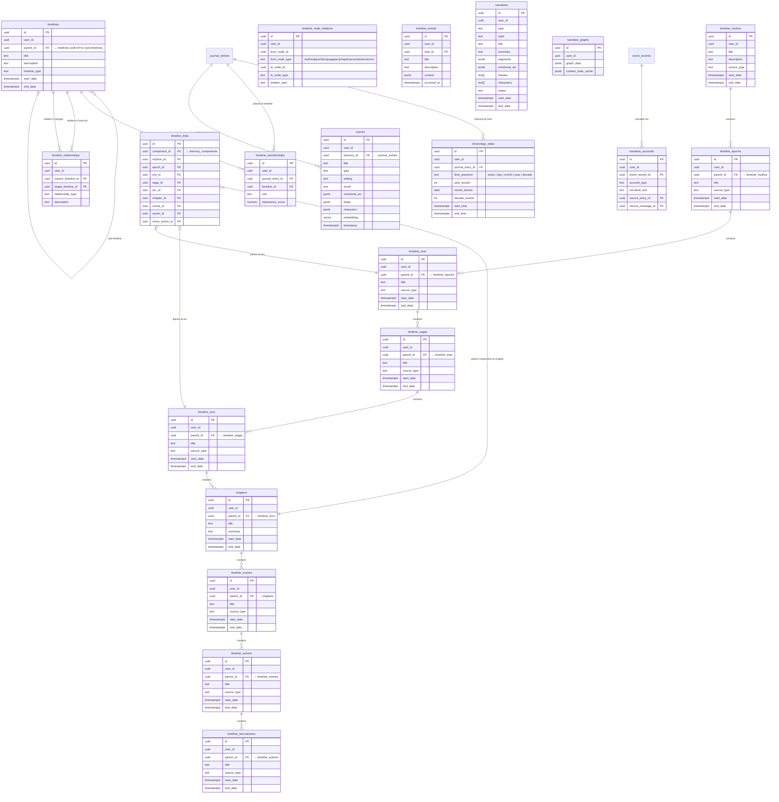

# ER Diagram: Timeline Domain

> Generated from `information_schema` on the live local Supabase DB (283 tables).

This diagram covers the **autobiographical time structure** — how entries, events,
and narrative moments are placed on a 7-level temporal hierarchy.



## Temporal hierarchy at a glance

```
timeline_mythos        — the entire life arc / founding myth
  └─ timeline_epochs   — multi-year periods ("college years")
       └─ timeline_eras  — major life phases ("living abroad")
            └─ timeline_sagas  — extended storylines ("building the startup")
                 └─ timeline_arcs   — meaningful chapters ("founding team drama")
                      └─ chapters   — discrete story chapters
                           └─ timeline_scenes  — individual scenes
                                └─ timeline_actions  — specific actions
                                     └─ timeline_microactions  — granular steps
```

| Table | Semantic role |
|---|---|
| `timelines` | User-named collections (flat), self-referencing for sub-timelines |
| `timeline_links` | Bridge that places a memory component at any level of the hierarchy |
| `chronology_index` | Fast time-range queries with bucketed precision |
| `narrative_accounts` | How an event was narrated (same event, multiple tellings) |
| `narrative_graphs` | Graph representation of narrative arcs and connections |
| `scenes` | Rich scene model: beats, characters, emotional arc, embedding |
