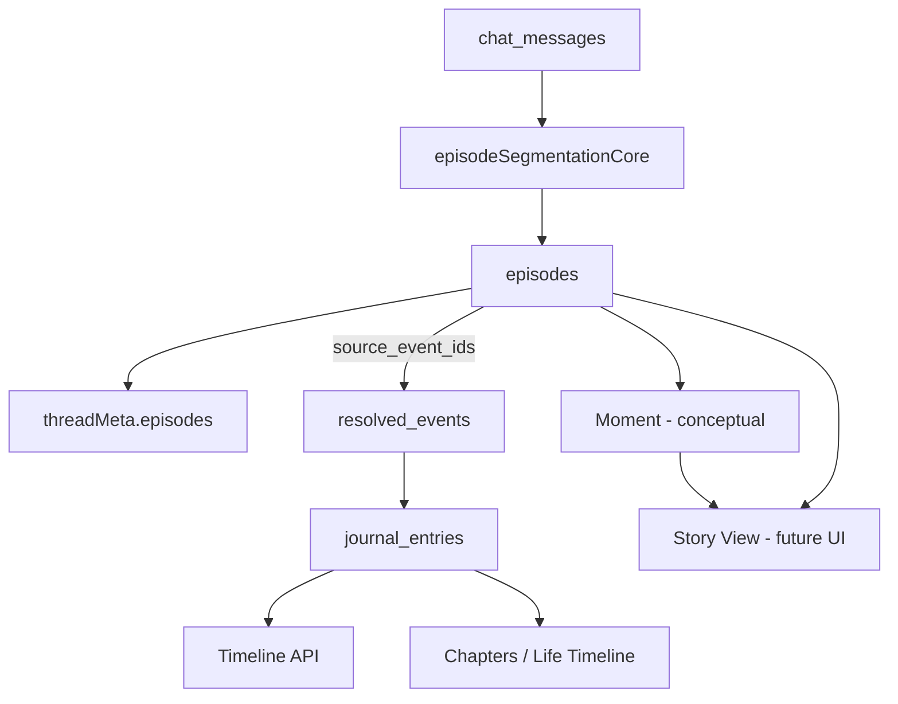

# Episode → Moment Mapping

Date: 2026-06-16 · **Mapping only** — no UI implementation in this sprint.

## Grain comparison

| Layer | Grain | Primary store | Time axis |
|---|---|---|---|
| **Episode** | Conversational scene (messages + entity/location context) | `episodes` | `start_at` / `end_at` from chat |
| **Event** | Resolved life event (title, summary, embedding) | `resolved_events` | `start_time` / `end_time` |
| **Moment** (product) | User-facing narrative beat | Not yet a table — conceptual | Derived |
| **Timeline entry** | Journal / memory row | `journal_entries` | Entry date |
| **Life Timeline** | Aggregated life phases | Chapters + timeline API | Chapter boundaries |

Episodes sit **between raw chat and resolved events** — they group messages into coherent scenes before (or alongside) event extraction.

## Mapping: Episodes → Moments

**Proposed rule (v1 conceptual):**

```
Moment.title       ← episodes.title
Moment.timeRange   ← [episodes.start_at, episodes.end_at]
Moment.people      ← resolve(participant_ids) → names
Moment.places      ← resolve(location_ids) → names
Moment.evidence    ← episodes.source_message_ids
Moment.events      ← episodes.source_event_ids (0..n linked events)
Moment.thread      ← episodes.source_thread_id
```

A **Moment** is the user-visible label for an episode. One episode → one Moment in the default case. Split/merge UI (user edits) would override without re-running segmentation.

**When episode has no events:** Moment still valid — grounded in messages only (matches provenance rule: no synthetic events).

**When multiple events fall in one episode:** Moment aggregates them; drill-down lists `source_event_ids`.

## Mapping: Episodes → Timeline (`/api/timeline`)

Timeline today reads **`journal_entries`** (and related memory rows), not episodes.

| Approach | Description | Sprint decision |
|---|---|---|
| A. Parallel layer | Timeline API adds optional `episode_id` facet | Defer — no API change in activation sprint |
| B. Event bridge | Events created/recovered with `metadata.episode_id` | Future — event recovery extension |
| C. Display-only | Story/timeline UI reads `episodes` directly for a date range | Future UI sprint |

**Recommended path:** **B then C** — attach `episode_id` to `resolved_events.metadata` during recovery, then let timeline queries union entry-based and episode-based rows for the same date.

## Mapping: Episodes → Life Timeline (Chapters)

Chapters cluster **timeline entries** by theme/time (`chapterInsightsService`).

```
Chapter
  └── contains many journal_entries (by date/theme)
        └── may reference resolved_events
              └── linked via episodes.source_event_ids
```

Episodes do **not** directly become chapters. Instead:

1. Episode → events (`source_event_ids`)
2. Events → journal entries (existing `event_mentions`)
3. Entries → chapters (existing insights pipeline)

**Indirect link:** An episode contributes to a chapter when its events' entries fall inside the chapter's date/theme cluster.

## Mapping: Episodes → Story View

Story View (narrative browse) benefits most from episodes:

| Story View element | Episode source |
|---|---|
| Scene card | `episodes.title` + `boundary_reason` |
| Cast | `participant_ids` → character names |
| Setting | `location_ids` → place names |
| Duration | `start_at` → `end_at` |
| Source drill-down | `source_message_ids` → chat transcript slice |
| Continuity | Same thread's episodes in `episode_index` order |

Story View can render **without** waiting for event recovery — episodes are message-evidence-complete on day one.

## Mapping diagram



## Thread intelligence (already wired)

`buildContinuityCard` → `Recent events: {episode titles}`

This is the **first user-visible Moment surface** — lightweight scene labels without full Story View.

## Implementation order (post-activation)

1. **Moment type** in shared types (id = `episodes.id`, display = `episodes.title`)
2. **Event recovery** — stamp `metadata.episode_id` when event time ⊆ episode window
3. **Timeline facet** — optional `?include=episodes` on `/api/timeline`
4. **Story View** — episode-ordered scene list per thread/month

No step above requires changing `episodeSegmentationCore`.
